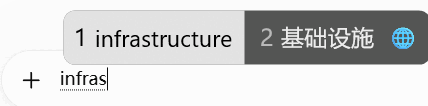

# RimeTranslate

**中文** | [English](README_EN.md)

> 在 Windows 小狼毫 / Rime 的**候选框里直接显示中英双向翻译**。  
> 中文候选 → 英文；英文候选 → 中文。翻译由本地 Ollama 模型完成，并通过异步 Bridge 与正常输入解耦。

[下载最新 Release](https://github.com/angery1/RimeTranslate/releases/latest) · [详细安装](docs/INSTALL_CN.md) · [模型选择](docs/MODELS.md)

## 实际效果

下面均为项目在 Windows 上的真实运行截图。

### 中文 → 英文

输入拼音后，英文翻译作为候选项出现：



### 英文 → 中文

保持在雾凇拼音中文模式，英文候选可得到中文翻译：


### 翻译开关

`Ctrl + Shift + Y` 在“翻译关 / 翻译开”之间切换：


## 主要功能

- 中文 ↔ 英文自动判断翻译方向；
- 翻译结果直接插入 Rime 候选框，不弹独立翻译窗口；
- 异步调用 Ollama，AI 推理不在 Rime 候选线程中同步等待；
- 默认本地推理，不依赖在线翻译网站；
- `gemma3:1b` 默认驻留约 2 分钟，减少连续翻译的冷启动；
- 托盘菜单可立即“释放翻译资源”；
- 支持当前 Windows 用户开机自启动。

## 快速安装

### 1. 准备运行环境

请先安装：

1. [小狼毫 Weasel](https://github.com/rime/weasel)
2. [雾凇拼音 rime-ice](https://github.com/iDvel/rime-ice)
3. [Ollama](https://github.com/ollama/ollama)

然后下载默认模型：

```powershell
ollama pull gemma3:1b
```

> Ollama 必须安装，但**不需要保持终端常开，也不需要设置开机自启动**。RimeTranslate 会在有翻译请求时按需连接或启动 Ollama。

### 2. 下载并解压 Release

到 [Releases](https://github.com/angery1/RimeTranslate/releases/latest) 下载：

```text
RimeTranslate-vX.Y.Z-windows-x64.zip
```

不要使用 `Code → Download ZIP`，那是源码包。

Release ZIP 内部已经包含顶层 `RimeTranslate` 文件夹。最简单的做法是直接解压到：

```text
C:\Users\你的用户名\
```

最终应当是：

```text
C:\Users\你的用户名\RimeTranslate\
├─ RimeTranslate.exe
├─ Install.cmd
├─ install.ps1
├─ check-environment.ps1
├─ README.md
├─ README_EN.md
├─ rime\
│  ├─ rime_ice.custom.patch.yaml
│  └─ lua\
│     ├─ async_ollama_filter.lua
│     └─ async_refresh.lua
└─ docs\
   ├─ INSTALL_CN.md
   ├─ INSTALL_EN.md
   ├─ MODELS.md
   └─ images\
```

**判断方法：**打开 `C:\Users\你的用户名\RimeTranslate\` 后，应立即看到 `RimeTranslate.exe` 和 `Install.cmd`。不要出现 `RimeTranslate\RimeTranslate\...` 的多层套娃目录。

### 3. 双击安装

运行：

```text
Install.cmd
```

安装器会安装 Lua、备份同名文件、设置 RimeTranslate 开机启动并启动 Bridge。如果你从未创建过 `rime_ice.custom.yaml`，安装器会自动创建所需配置；如果你已经有个人配置，它不会覆盖，详见 [详细安装说明](docs/INSTALL_CN.md)。

### 4. 重新部署小狼毫

```text
小狼毫 → 重新部署
```

### 5. 使用

按：

```text
Ctrl + Shift + Y
```

开启/关闭翻译。

中文 → 英文：正常输入拼音。  
英文 → 中文：保持在**雾凇拼音中文模式**，让英文进入 Rime 候选；纯 ASCII/西文直通模式会绕过候选 Filter，因此不会生成翻译候选。

## 模型怎么选

发布版当前默认使用 **`gemma3:1b`**。下面的模型大小来自 Ollama 模型库；“建议空闲内存”是面向本项目短文本输入场景的**经验建议，不是官方硬性要求**。实际 RAM/VRAM 占用还会受到量化、上下文长度、CPU/GPU offload 和 Ollama 版本影响。

| 模型 | Ollama 模型大小 | 建议空闲系统内存 | 特点 | 推荐 |
| --- | ---: | ---: | --- | --- |
| `gemma3:270m` | 292 MB | 1–2 GB | 最轻、最快，质量较弱 | 极低配置 |
| `qwen2.5:0.5b` | 398 MB | 2–3 GB | 很轻，对中英文本较友好 | 低配置推荐 |
| **`gemma3:1b`** | **815 MB** | **3–4 GB** | 速度、质量、资源较均衡 | **默认推荐** |
| `qwen2.5:1.5b` | 986 MB | 4–6 GB | 更偏重翻译质量 | 质量优先推荐 |
| `qwen2.5:3b` | 1.9 GB | 6–8 GB | 质量更高，但延迟和占用增加 | 资源充足时 |
| `gemma3:4b` | 3.3 GB | 8–12 GB | 更重，输入法场景收益有限 | 不建议默认 |

CPU-only 可以运行；有可用 GPU 时 Ollama 可自动进行 GPU/CPU offload。使用：

```powershell
ollama ps
```

可查看模型当前是 `100% CPU`、`100% GPU`，还是 CPU/GPU 混合加载。

> 如果还要同时运行 Vivado、综合或大型仿真，优先使用 `gemma3:1b` 或 `qwen2.5:0.5b`。开始重任务前可右键 Rime Translate 托盘图标 → **释放翻译资源**。

当前发布版把模型名写在 `src/main.go` 的 `modelName` 中；切换其他模型需要修改模型名并重新构建。详细说明见 [docs/MODELS.md](docs/MODELS.md)。

## 工作原理

```text
小狼毫 / Rime / 雾凇拼音
        ↓
async_ollama_filter.lua
        ↓ request.txt
RimeTranslate.exe
        ↓
Ollama + 本地模型
        ↓ response.txt
async_refresh.lua + 候选刷新
        ↓
翻译结果进入候选框
```

更详细的实现见 [架构说明](docs/ARCHITECTURE.md)。

## 可扩展性

RimeTranslate 并不局限于“中英翻译”。它的核心是：

```text
Rime 候选 → 本地后台 Bridge → 本地 AI 模型 → 结果重新注入候选框
```

因为后端使用本地 AI 模型，只要修改 Prompt、模型和结果处理逻辑，就可以继续扩展为多语言翻译、英文润色、语法纠错、文本简写/扩写、专业术语解释、固定风格改写，或接入其他 Ollama / 本地推理后端。

**中英双向翻译只是这个架构的第一个应用场景。**

## 更多文档

- [详细安装](docs/INSTALL_CN.md)
- [模型选择与资源说明](docs/MODELS.md)
- [架构说明](docs/ARCHITECTURE.md)
- [开发说明](docs/DEVELOPMENT.md)
- [更新记录](CHANGELOG.md)
- [第三方依赖与许可证](THIRD_PARTY_NOTICES.md)

## 已知限制

- 当前主要面向 Windows x64；
- 英文 → 中文依赖当前 Rime 方案能够产生英文候选；
- 含空格的完整英文长句还不是当前候选链最理想的输入形式；
- 第一次加载模型通常比模型驻留期间的后续翻译慢；
- 当前 Lua ↔ Bridge 使用本地文件异步通信，后续可进一步改为 Named Pipe / 本地 IPC。

## License

本仓库自行编写的代码、Lua、脚本与文档使用 [MIT License](LICENSE)。Weasel、rime-ice、Ollama、Gemma 等第三方项目继续遵循各自许可证，本仓库不对其重新授权。
